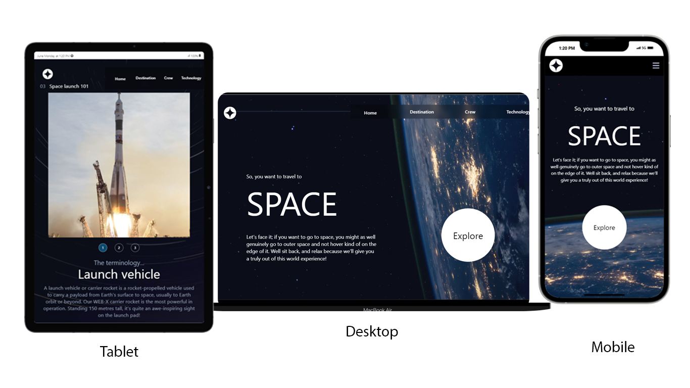

# Space Tourism Website

This project is a multi-page space tourism website built as part of a challenge on [Frontend Mentor](https://www.frontendmentor.io). The goal was to build a website that closely matches the provided design using HTML, CSS, and JavaScript. I also did my best to make it as responsible as possible and added some hover and active state effects.

## Overview

### Screenshot

### Links

- [Live Site URL](https://your-live-site-url.com)
- [Frontend Mentor Solution Page](https://www.frontendmentor.io/solutions/your-solution-url)

### Built With

- Semantic HTML5 markup
- CSS custom properties
- Flexbox
- CSS Grid
- Mobile-first workflow
- [React](https://reactjs.org/) - JS library
- [Tailwind CSS](https://tailwindcss.com/) - For styling

### What I Learned

In this project, I learned how to:

- Implement responsive design using Tailwind CSS.
- Utilize React and css ID classes to create a multi-page application.
- Fetch and render data from a local JSON file.
- Manage component state to dynamically display content.
- Optimize images and other assets for different screen sizes.

### Useful Resources

- [Frontend Mentor](https://www.frontendmentor.io) - This challenge provided the design and project brief.
- [React Documentation](https://reactjs.org/docs/getting-started.html) - Official React documentation.
- [Tailwind CSS Documentation](https://tailwindcss.com/docs) - Tailwind CSS documentation for utility-first styling.

## Author

- Frontend Mentor - [@ibrahimmakanta](https://www.frontendmentor.io/profile/yourusername)
- Twitter - [@ibrahimmakanta](https://twitter.com/yourusername)
- LinkedIn - [Your Name](https://linkedin.com/in/yourusername)

## Acknowledgments

Thanks to Frontend Mentor for providing this challenge and the community for the support and feedback.
